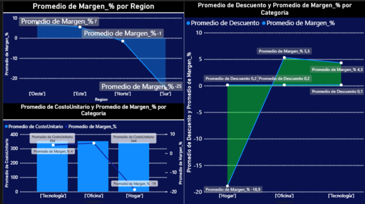

# 📊 Análisis de Ventas Altas con Baja Rentabilidad

Este proyecto explora un problema común en negocios:

👉 **Vender mucho no siempre significa ganar dinero.**

A través del análisis de datos, se detectó que existen productos con:

- Altas ventas
- Alta cantidad vendida  
- Pero **bajo margen de ganancia** e incluso pérdidas

---

## 🎯 Objetivo del Proyecto

Identificar por qué algunas áreas del negocio venden mucho pero generan poca rentabilidad.

El análisis reveló que:

📉 **El descuento aplicado y el costo unitario afectan fuertemente el margen de ganancia.**

Este impacto es especialmente visible en:

- 🏠 Categoría: **Hogar**
- 🌎 Región: **Sur**

---

## 🔍 Variables Analizadas

Se estudiaron los siguientes indicadores clave:

- Ventas
- Cantidad vendida
- Margen de ganancia
- Pérdidas

Esto permitió detectar patrones ocultos donde el volumen alto estaba ocultando baja rentabilidad.

---

## ⚠️ Hallazgo Principal

Los productos de la categoría **Hogar** en la región **Sur** presentan:

- Descuentos elevados
- Costos unitarios altos

➡️ Resultado:

Margen reducido o negativo, incluso con buenas ventas.

En términos simples:

> Se vende mucho… pero se gana poco.

---

## 🛠️ Tecnologías Utilizadas

- Python  
- Pandas  
- Power BI  
- Git  
- GitHub  

---

## 📈 Visualización (Power BI)

Aquí se puede observar el gráfico utilizado para identificar la baja rentabilidad:



---

## 📁 Estructura del Proyecto

```
📦 proyecto
 ┣ 📂 data
 ┃ ┗ 📄 proyect.xlsx
 ┣ 📄 retail_ventas_proyecto.csv
 ┣ 📄 analysis.py
 ┣ 📄 info.py
 ┣ 📄 PowerVisual.png
 ┣ 📄 LICENSE
 ┗ 📄 README.md
```

---

## 🧠 Conclusión

Las ventas altas pueden ocultar problemas de rentabilidad.

En este caso, el análisis permitió detectar que:

✔️ Descuentos excesivos  
✔️ Costos unitarios elevados  

Estaban reduciendo significativamente el margen de ganancia en una categoría y región específica.

Esto demuestra cómo el análisis de datos permite tomar decisiones más inteligentes que solo mirar el volumen de ventas.
