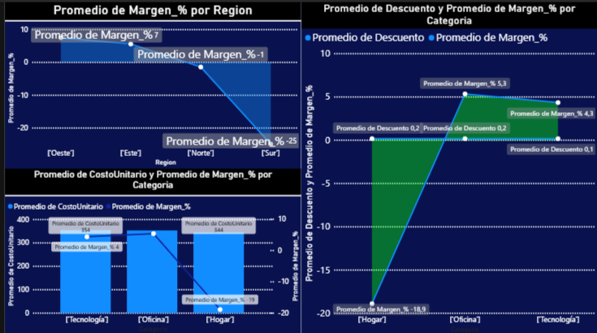

# 📊 Análisis de Ventas con Alta Facturación y Baja Rentabilidad


---

# 📖 Descripción

Las empresas suelen evaluar su desempeño a partir del volumen de ventas. Sin embargo, vender más no siempre significa generar mayores beneficios.

Este proyecto desarrolla un análisis de datos para identificar productos con **altas ventas pero baja rentabilidad**, detectando los factores que afectan el margen de ganancia y proporcionando información útil para optimizar la estrategia comercial.

Mediante técnicas de análisis exploratorio y visualización de datos, se identifican patrones ocultos que permiten comprender por qué determinados productos generan ingresos elevados, pero aportan un beneficio económico reducido.

---

# 🎯 Problema de Negocio

En muchos negocios existen productos con un elevado volumen de ventas que, debido a descuentos excesivos o altos costos operativos, generan márgenes muy bajos e incluso pérdidas.

Este proyecto busca responder preguntas clave para la toma de decisiones:

- ¿Qué productos venden mucho pero generan poca rentabilidad?
- ¿Qué categorías presentan menores márgenes de ganancia?
- ¿Qué regiones concentran las mayores pérdidas?
- ¿Qué variables impactan directamente en la rentabilidad del negocio?
- ¿Cómo pueden optimizarse las estrategias comerciales para aumentar el beneficio?

---

# 🎯 Objetivos

- Analizar el comportamiento de las ventas y la rentabilidad.
- Detectar productos con alto volumen de ventas y bajo margen.
- Identificar categorías y regiones con menor rendimiento financiero.
- Analizar el impacto de descuentos y costos sobre la ganancia.
- Generar información estratégica para apoyar decisiones comerciales.

---

# 🛠 Tecnologías Utilizadas

| Categoría | Tecnologías |
|-----------|-------------|
| Lenguaje | Python |
| Librerías | Pandas |
| Visualización | Power BI |
| Fuente de Datos | CSV · Excel |
| Control de Versiones | Git · GitHub |

---

# ⚙️ Metodología de Trabajo

## 1. Ingesta de Datos

- Carga del conjunto de datos de ventas.
- Validación de registros.
- Verificación de consistencia.

---

## 2. Limpieza y Transformación

- Normalización de datos.
- Validación de tipos de datos.
- Preparación de variables para el análisis.
- Organización del conjunto de datos.

---

## 3. Análisis Exploratorio (EDA)

Se analizaron variables relacionadas con:

- Ventas.
- Cantidad vendida.
- Costos.
- Descuentos.
- Margen de ganancia.
- Categorías.
- Regiones.

---

## 4. Visualización

Se desarrolló un dashboard en Power BI para facilitar la interpretación de los resultados mediante gráficos e indicadores visuales.

---

# 📊 KPIs Analizados

- Ventas Totales.
- Cantidad de Productos Vendidos.
- Margen de Ganancia.
- Rentabilidad por Categoría.
- Rentabilidad por Región.
- Productos con Mayor Facturación.
- Productos con Menor Rentabilidad.
- Impacto de Descuentos.
- Impacto del Costo Unitario.

---

# 📈 Principales Hallazgos

El análisis permitió identificar patrones relevantes:

- La categoría **Hogar** concentra productos con altas ventas pero baja rentabilidad.
- La región **Sur** presenta el menor margen de ganancia.
- Los descuentos elevados reducen significativamente el beneficio obtenido.
- El aumento del costo unitario impacta directamente sobre el margen final.
- Un mayor volumen de ventas no garantiza una mayor rentabilidad.

---

# 💡 Insight Principal

> El volumen de ventas, por sí solo, no representa el verdadero desempeño financiero de un negocio. Analizar simultáneamente ingresos, costos y márgenes permite identificar oportunidades de mejora que permanecen ocultas cuando solo se observa la facturación.

---

# 📈 Dashboard

## Visualización Principal



---

# 📂 Estructura del Proyecto

```text
Analisis-de-Baja-Rentabilidad/

│── data/
│   └── proyect.xlsx
│
│── retail_ventas_proyecto.csv
│── analysis.py
│── info.py
│── PowerVisual.png
│── LICENSE
│── README.md
```

---

# 💼 Valor para el Negocio

Este proyecto proporciona información útil para:

- Detectar productos poco rentables.
- Optimizar estrategias de precios y descuentos.
- Identificar categorías con menor margen de ganancia.
- Priorizar acciones sobre regiones con bajo rendimiento.
- Incrementar la rentabilidad mediante decisiones basadas en datos.

---

# 🚀 Cómo Ejecutar el Proyecto

## Clonar el repositorio

```bash
git clone https://github.com/Aaronisaias/Analisis-de-Baja-Rentabilidad.git
```

## Instalar dependencias

```bash
pip install pandas openpyxl
```

## Ejecutar el análisis

```bash
python analysis.py
```

El proceso realiza automáticamente:

- Carga de datos.
- Limpieza y transformación.
- Análisis exploratorio.
- Generación de métricas.
- Preparación de datos para Power BI.

---

# 🔮 Próximas Mejoras

- Integración con SQL Server.
- Automatización completa del proceso ETL.
- Dashboard interactivo con filtros dinámicos.
- Modelos predictivos para estimar rentabilidad futura.
- Incorporación de indicadores financieros avanzados.
- Automatización de reportes ejecutivos.

---

# 📌 Conclusión

Este proyecto demuestra cómo el análisis de datos permite ir más allá del volumen de ventas para comprender el verdadero rendimiento financiero de un negocio.

La combinación de Python, Pandas y Power BI permitió identificar productos, categorías y regiones con baja rentabilidad, proporcionando información estratégica para optimizar precios, reducir pérdidas y mejorar la toma de decisiones.

---

# 👨‍💻 Autor

**Aaron Isaías Medina**

**Analista de Datos | SQL | Python | ETL | Power BI | Automatización | Business Intelligence**

📧 **Disponible para oportunidades como Analista de Datos Junior**
